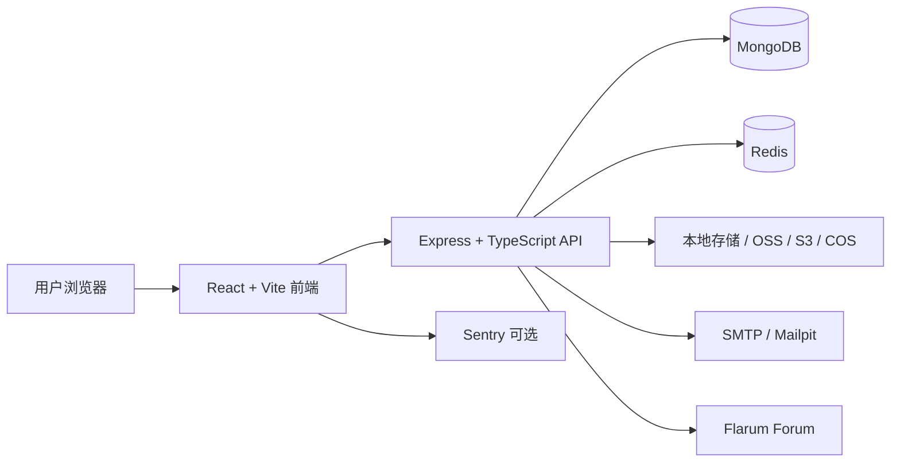

# CarRadioWeb


[](https://github.com/Leolty0511/CarRadioWeb/actions/workflows/ci.yml)
[](https://nodejs.org/)
[](https://react.dev/)
[](https://www.typescriptlang.org/)
[](LICENSE)

> A bilingual automotive knowledge platform for Android car radios, head units, CANBus/CANBox integration, wiring guides, operation tutorials, user manuals, software downloads, member accounts, and forum support.

## 中文说明

### 项目简介

CarRadioWeb 是面向汽车安卓主机和车载电子产品的双语知识库与客户服务平台。它把车型适配、CANBus 设置、主机接线、主机操作教程、用户手册、软件下载、公告、会员中心和论坛支持整合到一个可维护、可扩展的 Web 应用中。

当前稳定版本为 **2.0.0**。本版本完成主站与 Flarum 的统一身份、管理员角色同步、一人多车和默认车辆，以及可配置的 IP 安全防护中心。

> 生产部署前请先阅读 [`docs/security-center.md`](docs/security-center.md)。该文档说明可信代理、Cloudflare 真实 IP、Nginx/CrowdSec、Redis/MongoDB 资源策略和安全中心 API。

项目适合用于：

- 汽车安卓主机、车载导航、车机屏幕和相关配件的产品支持；
- 按车型、年份和主机型号提供 CANBus/CANBox 配置说明；
- 提供主机接线图、图文教程、视频教程和常见问题；
- 管理用户手册、固件或软件资源，并绑定适用的主机型号；
- 为会员提供登录、收藏、反馈、论坛和公告等服务；
- 通过后台权限、审计日志和一键资源包更新维护生产环境。

### 核心功能

#### 面向用户

| 模块         | 说明                                                                               |
| ------------ | ---------------------------------------------------------------------------------- |
| 知识库首页   | 统一入口，返回车型接线、视频教程、主机操作教程、图文教程和 CANBus 设置             |
| 车型数据     | 按品牌、车型和年份浏览结构化车型资料，支持独立详情页                               |
| CANBus 设置  | 先选择车型年份，再选择主机型号，自动显示对应的 CANBus 设置图片和说明               |
| 主机型号识别 | 以图片和文字帮助用户辨识安卓主机；点击“使用此主机型号”后可自动回填选择器并关闭弹窗 |
| 主机接线教程 | 按车型和主机类型提供基本信息、图文步骤和常见问题                                   |
| 视频教程     | 提供安装、操作和产品使用视频，详情页拥有独立 URL                                   |
| 用户手册     | 按主机型号筛选 PDF 手册，详情页支持预览、下载和新窗口打开                          |
| 软件下载     | 按主机型号筛选软件或固件资源，详情页提供说明、注意事项和下载入口                   |
| 公告中心     | 有未读公告时铃铛直接打开最新公告；已读后再查看历史公告列表                         |
| 会员中心     | 支持邮箱、账号或昵称登录，并提供资料、收藏和反馈功能                               |
| 会员车辆     | 支持一人多车、默认车辆、年份区间、Generation、车辆快照和论坛展示开关               |
| 论坛         | 与 Flarum 1.8.17 桥接，主站会员/管理员自动 SSO，历史原生论坛账号继续保留           |

#### 后台管理

- 文档、车型、分类、视频、图文教程和常见问题管理；
- CANBox 类型、主机型号和 CANBus 设置管理；
- 用户手册与软件下载资源管理，并绑定主机型号；
- 普通管理员与超级管理员权限分离；
- 管理员列表、会员中心、系统设置和版本更新按权限开放；
- 公告、站点设置、SEO 设置、页面内容、产品、新闻、资源和表单管理；
- 图片上传、缩略图、高清图和 WebP 资源处理；
- 访问统计、搜索记录、收藏、审计日志和错误监控；
- 支持 GitHub Actions 构建生产资源包，由官网后台拉取更新。

#### IP 安全防护中心

后台 **Security → IP Security** 只向管理员开放：普通管理员可查看，超级管理员才可执行 Ban/Unban、修改阈值和维护白名单。页面包含活跃 IP、当前封禁、可疑 IP、今日攻击事件、Top 请求 IP、Top 攻击 IP、IP 详情和最近请求。

- 支持 IPv4/IPv6、IP/URL/时间/状态筛选、分页和请求明细；
- 可配置请求/分钟、API 请求、登录失败、404 Flood、可疑和硬封禁阈值；
- 支持 1 小时、6 小时、24 小时、7 天和永久封禁，所有操作写入审计日志；
- 白名单不会被自动封禁；自动检测优先使用 Redis，访问明细异步批量写入 MongoDB；
- 请求明细默认保留 7 天，安全事件默认保留 90 天，避免每个请求直接写 MongoDB；
- 生产推荐 Nginx + CrowdSec 作为边界拦截，应用层封禁作为没有 CrowdSec 时的兜底。

## 2.0.0 账户、论坛和车辆规则

| CarRadioWeb 身份 | Flarum 组 | 说明 |
| --- | --- | --- |
| 超级管理员 | Administrator | 主站角色是权限最终来源 |
| 普通管理员 | Moderator | 普通管理员没有安全中心写权限 |
| 会员 | Member | 会员资料和车辆不向其他论坛用户暴露 |
| 历史 Flarum 用户（无主站账号） | 保留原组 | 继续使用 Flarum 原生登录 |

管理员使用邮箱或现有后台凭据登录主站；进入论坛时由 FoF Passport 完成 OAuth/SSO。邮箱、地址、内部 ID 等敏感信息不会传给论坛前台。一个会员可保存多辆车，最多 10 辆，设置的默认车辆会自动用于知识库选择器；车型目录使用品牌、车型、年份区间和 Generation，面向跨境用户不依赖中文品牌名。

### 内容路由与 SEO

列表页和内容详情页使用独立 URL，方便分享、刷新和搜索引擎收录。

```text
/knowledge/vehicle-data
/knowledge/vehicle/{vehicle-slug}

/knowledge/video-tutorials
/knowledge/video/{video-slug}

/knowledge/device-operation-videos
/knowledge/video/{operation-video-slug}

/knowledge/tutorials
/knowledge/article/{article-slug}

/knowledge/canbus-settings

/user-manual
/user-manual/{manual-slug}

/software-downloads
/software-downloads/{software-slug}
```

用户手册和软件下载详情优先使用可读的内容 slug，不主动暴露 MongoDB ID。历史 ID 链接仍保留兼容，避免已发布链接失效。项目同时生成动态 `sitemap.xml`，收录知识库、用户手册和软件下载详情页。

### 技术架构



主要技术：

- 前端：React 19、TypeScript、Vite、React Router、Tailwind CSS、i18next；
- UI 与交互：自定义组件、Framer Motion、Lucide、PrimeReact、Embla Carousel；
- 后端：Node.js 20、Express、TypeScript、Mongoose；
- 数据与缓存：MongoDB、Redis；
- 文件与图片：Multer、Sharp，可对接阿里云 OSS、S3、腾讯云 COS 等对象存储；
- 安全：Helmet、CORS、JWT、Session、限流、MongoDB 注入防护、权限中间件；
- 运维：Docker、Docker Compose、Nginx、PM2、GitHub Actions；
- 监控：Sentry、访问统计、审计日志和系统健康检查。

### 本地开发

环境要求：

- Node.js 20 或更高版本；
- npm 10 或更高版本；
- MongoDB 6 或更高版本；
- Redis 7 或更高版本；
- 如需邮箱验证码，可使用 SMTP 或 Docker Compose 内置的 Mailpit。

安装依赖：

```bash
npm ci
cd backend
npm ci
cd ..
```

配置环境变量：

```bash
copy .env.example .env.local
```

按实际环境填写 `VITE_API_BASE_URL`、`VITE_SITE_URL`、数据库、JWT、对象存储、SMTP 和可选的 AI/Sentry 配置。不要把真实密钥提交到 Git。

启动前端：

```bash
npm run dev
```

启动后端：

```bash
npm run dev:backend
```

同时启动前后端：

```bash
npm run dev:all
```

停止本地服务：

```bash
npm run dev:stop
```

### Docker 部署

1. 复制 Docker 环境变量示例并填写真实值：

   ```bash
   cp .env.docker.example .env
   ```

2. 启动完整服务：

   ```bash
   docker compose up -d --build
   ```

3. 查看服务状态：

   ```bash
   docker compose ps
   docker compose logs -f web
   ```

Docker Compose 默认包含 Web、MongoDB、Redis、Mailpit 和 Nginx。生产环境应更换强 JWT 密钥、MongoDB 密码和对象存储密钥，并通过 HTTPS 暴露服务。

#### 生产安全部署

- 只允许 Nginx/Cloudflare 访问 Node 端口；在 `TRUSTED_PROXY_IPS` 中填写实际反向代理地址或内网网段。
- 经过 Cloudflare 时，按 [`docs/security-center.md`](docs/security-center.md) 配置官方 Cloudflare 网段和真实 IP 处理，不能直接信任任意客户端请求头。
- IP 安全中心使用 Redis 保存分钟级计数和临时封禁，MongoDB 保存事件、聚合 IP、封禁历史和白名单；访问明细默认 7 天、事件默认 90 天 TTL。
- 生产建议在 Nginx 前接入 CrowdSec；没有 CrowdSec 时，CarRadioWeb 仍提供应用层封禁兜底，但它不替代边界拦截。
- 后台一键更新会在拉取资源包或合并代码前自动备份 MongoDB、Flarum 数据库和主站上传文件；可选备份 Flarum `/data`。生产环境默认开启，任一必需备份失败会阻止更新。
- 将 `UPDATE_BACKUP_DIR` 挂载到独立、持久化的磁盘目录，并按 [`backend/config.env.example`](backend/config.env.example) 配置 `mongodump`、`mariadb-dump`/`mysqldump` 或 Docker 容器导出参数。Docker 重建后仍须保留该目录。
- 备份目录内会生成 `backup-manifest.json`，默认保留最近 7 份，可用 `UPDATE_BACKUP_RETENTION_COUNT` 调整。备份只保护数据，不会自动把数据库恢复到旧版本；代码回滚和数据恢复是两个独立动作，仍建议额外做异地/云端备份。

Flarum 生产基线为 1.8.17、PHP 8.4.x、MariaDB/MySQL。论坛相关 Compose 和桥接扩展位于 [`docker-compose.flarum.yml`](docker-compose.flarum.yml) 与 [`forum-extensions/`](forum-extensions/)，部署脚本位于 [`scripts/`](scripts/)。

### 常用命令

| 命令                                             | 用途                       |
| ------------------------------------------------ | -------------------------- |
| `npm run type-check`                             | 前端 TypeScript 类型检查   |
| `npm run lint`                                   | 前端 ESLint 检查           |
| `npm run test:run`                               | 执行前端测试               |
| `npm run build`                                  | 编译后端并构建前端         |
| `npm run test:build`                             | 类型检查、Lint、测试和构建 |
| `npm run preview`                                | 预览前端生产构建           |
| `cd backend && npm run build`                    | 单独构建后端               |
| `cd backend && npm run migrate:knowledge-images` | 执行知识库图片迁移脚本     |
| `cd backend && node dist/scripts/runMigration.js status` | 查看数据库迁移状态 |
| `cd backend && node dist/scripts/runMigration.js run` | 执行待处理数据库迁移 |
| `cd backend && node dist/scripts/runMigration.js rollback 005` | 回滚指定迁移 |

### 发布与更新

推送到 `main` 分支或 `v*` 标签后，GitHub Actions 会执行检查、构建并生成 `caradioweb-deploy.tar.gz` 生产部署资源包。官网后台可以拉取 `latest` 资源包完成更新，正式版本可从对应 Release 下载。

- [最新资源包](https://github.com/Leolty0511/CarRadioWeb/releases/tag/latest)
- [v2.0.0 资源包](https://github.com/Leolty0511/CarRadioWeb/releases/tag/v2.0.0)
- 生产流程：自动备份 → 拉取资源包 → 校验版本和 `/health` → 执行待处理迁移 → 重启 → 验证主站登录、Flarum SSO、车辆接口和安全中心。

版本号与资源包发布相互独立：

- 普通功能修复可以不修改版本号；
- 需要正式版本发布时，再同步修改 `package.json`、`backend/package.json` 和 `CHANGELOG.md`；
- 每次推送涉及用户可见功能时，应在 `CHANGELOG.md` 的“未发布”区补充中文更新说明。

### 图片处理说明

知识库图片采用独立处理流程：

- 原图经过方向校正、尺寸处理和 WebP 转换；
- 列表优先使用缩略图，详情或弹窗加载高清图；
- CANBus 接线图、CANBox 图片、主机型号识别图和知识库图文内容使用统一资源路径；
- 现有历史图片可使用一次性迁移脚本转换，脚本不会影响其他业务图片。

### 安全与数据注意事项

- `.env*`、`backend/config.env`、`ai-config.json` 和上传数据不应提交到 Git；
- 生产环境必须使用随机、足够长度的 `JWT_SECRET`；
- 对象存储密钥、SMTP 密码和 OpenAI 密钥只能通过服务器环境变量注入；
- `backend/uploads/` 是运行时数据目录，部署时应使用持久化卷或对象存储；
- 任何数据库迁移和历史图片清理前都应先备份数据库和文件。

### 项目关键词

```text
汽车安卓主机, 车载导航, 车机知识库, 汽车电子, 主机接线教程,
CANBus, CANBox, CAN 总线, 车型适配, 车型年份, 主机型号,
安卓车机操作教程, 车载系统用户手册, 车机软件下载, 固件下载,
汽车安装教程, 视频教程, 图文教程, 常见问题, 会员中心,
Flarum 论坛, React 知识库, TypeScript, MongoDB, SEO 知识库
```

## English Documentation

### Overview

CarRadioWeb is a bilingual knowledge base and customer-support platform for Android car radios, aftermarket head units, vehicle integration products, and automotive electronics. It combines vehicle compatibility data, CANBus/CANBox settings, head-unit wiring guides, operation tutorials, user manuals, software downloads, announcements, member services, and Flarum forum support in one maintainable application.

It is designed for:

- Android head units, car stereos, navigation displays, and vehicle integration accessories;
- Vehicle/year-based CANBus and CANBox configuration guidance;
- Head-unit wiring diagrams, illustrated guides, video tutorials, and FAQs;
- Model-specific user manuals, firmware, and software downloads;
- Member accounts, favorites, feedback, announcements, and forum access;
- Role-based administration, audit logs, observability, and one-click deployment-package updates.

### Feature Highlights

- Bilingual public interface with English and Chinese content support;
- Vehicle data organized by brand, model, and year;
- CANBus settings selected by vehicle/year and head-unit type;
- Head-unit identification cards with images, descriptions, and optional auto-fill;
- Head-unit wiring guides with basic information, illustrated steps, and FAQs;
- Installation and device-operation video tutorials;
- User manual PDF preview, download, and standalone SEO-friendly detail pages;
- Software and firmware resources filtered by head-unit type;
- Unread-announcement behavior that opens the newest announcement first;
- Member login with email, account name, or nickname;
- Multiple vehicles per member, a default vehicle, vehicle snapshots, year ranges, and Generation fields;
- Flarum 1.8.17 integration with main-site OAuth/SSO, administrator/moderator role sync, and native legacy-user login preservation;
- Configurable IP Security Center with Redis counters, MongoDB aggregation, IP details, security events, allowlist, temporary/permanent bans, and read-only access for regular administrators;
- Trusted-proxy and Cloudflare-aware client IP handling, Nginx/CrowdSec deployment guidance, and audit logging;
- Flarum forum integration with plugin-state preservation during updates;
- Admin access control for administrators, members, system settings, and version updates;
- WebP knowledge-image processing with thumbnails and high-resolution assets;
- Dynamic SEO metadata, JSON-LD, canonical URLs, breadcrumbs, and sitemap generation;
- Docker, Nginx, PM2, and GitHub Actions deployment support.

### URL Design

Content pages use readable, shareable, and indexable paths:

```text
/knowledge/vehicle/{vehicle-slug}
/knowledge/video/{video-slug}
/knowledge/article/{article-slug}
/user-manual/{manual-slug}
/software-downloads/{software-slug}
```

Manual and software detail URLs use content slugs instead of exposing MongoDB IDs in newly generated links. Legacy ID URLs remain compatible for existing links. Published detail pages are included in the generated `sitemap.xml`.

### Development and Deployment

Use Node.js 20+, MongoDB 6+, Redis 7+, and npm.

```bash
npm ci
cd backend && npm ci && cd ..

npm run dev:all

# Validation
npm run type-check
npm run lint
npm run test:run
npm run build
```

For Docker:

```bash
cp .env.docker.example .env
docker compose up -d --build
```

The production image contains the built frontend, compiled backend, and production backend dependencies. GitHub Actions can build and publish the deployment archive consumed by the website administration updater.

### Search and Recommendation Keywords

```text
automotive knowledge base, Android car radio, Android head unit,
car stereo installation guide, head unit wiring guide, CANBus settings,
CANBox integration, vehicle compatibility, car radio user manual,
firmware download, car stereo software, vehicle-specific tutorial,
head unit operation tutorial, automotive electronics support,
React knowledge base, TypeScript, Express, MongoDB, Flarum forum,
SEO-friendly documentation platform, bilingual automotive documentation
```

### License

This project is released under the [MIT License](LICENSE).

## Links

- Repository: [github.com/Leolty0511/CarRadioWeb](https://github.com/Leolty0511/CarRadioWeb)
- Changelog: [CHANGELOG.md](CHANGELOG.md)
- License: [LICENSE](LICENSE)
