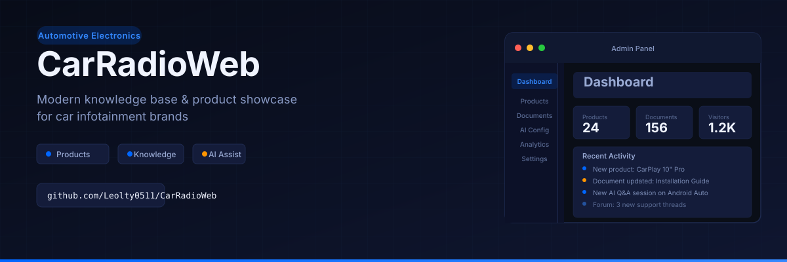
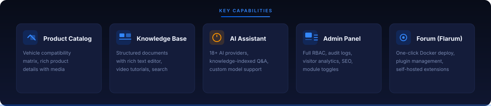

<p align="center">
  
</p>

<p align="center">
  <strong>English</strong> · <a href="#中文">中文</a>
</p>

---

<a id="english"></a>

<br>

<p align="center">
  
</p>

<br>

**CarRadioWeb** is a full-featured knowledge base and product showcase platform for automotive electronics aftermarket brands. Manage product documentation, vehicle compatibility, AI-powered support, and a community forum — all from a unified admin panel.

**Target products:** Car head units, CarPlay / Android Auto adapters, dash cameras, and related aftermarket infotainment electronics.

---

## Features

<p align="center">
  
</p>

### Public Site

| Feature | Details |
|---------|---------|
| 🌐 **Multi-language** | English, Chinese, Russian — full i18n |
| 📦 **Product Catalog** | Vehicle compatibility matrix, rich media, categories |
| 📚 **Knowledge Base** | Structured documents, rich text editor, video tutorials, search |
| 🤖 **AI Assistant** | 18+ providers, knowledge-indexed Q&A, custom model |
| 🎨 **Theme** | Dark/light toggle, responsive design |
| 🛠 **Tools** | Audio EQ reference, audio file generator |

### Admin Panel (`/admin`)

| Module | Description |
|--------|-------------|
| Document Management | Rich text editor, video, drafts, structured articles |
| Product Management | CRUD + vehicle compatibility matrix |
| Category Management | Hierarchical with sorting |
| AI Configuration | 18+ providers, custom model, usage tracking |
| Hero Banners | Homepage carousel configuration |
| Visitor Analytics | Geo-location, device stats, page views |
| User Management | Invite by email, RBAC permissions |
| Audit Log | Operation history (30-day retention, super_admin) |
| Site Settings | Name, description, copyright, social links, default map |
| SEO Settings | Per-page meta tags, keywords, Open Graph |
| Module Settings | Toggle frontend modules, Flarum forum management |
| Storage Settings | Alibaba Cloud OSS configuration |
| CAN Bus Settings | Vehicle CAN bus parameter management |
| Flarum Forum | One-click Docker deploy, plugin install/uninstall, self-hosted extensions |
| Compliance & Leads | Cookie banner, legal pages, newsletter, email campaigns |

### Public API (no auth)

| Endpoint | Purpose |
|----------|---------|
| `GET /api/legal-versions/public?docType=privacy\|terms\|disclaimer` | Latest legal version |
| `GET /api/legal-versions/content/public?docType=…&locale=en\|zh` | Legal content by locale |
| `POST /api/newsletter/subscribe` | Email newsletter signup |
| `POST /api/newsletter/unsubscribe` | Body: `{ "token": "…" }` |

---

## Quick Start

### Prerequisites

- Node.js >= 18
- MongoDB >= 6
- Redis (optional — falls back to memory cache)

### Install

```bash
npm install
cd backend && npm install && cd ..
```

### Configure

```bash
cp .env.example .env.local
cp backend/config.env.example backend/config.env
```

**Backend** (`backend/config.env`):

| Variable | Required | Description |
|----------|----------|-------------|
| `MONGODB_URI` | Yes | MongoDB connection string |
| `JWT_SECRET` | Yes | Strong random string for auth |
| `SESSION_SECRET` | Yes | Express session secret |
| `SMTP_HOST` / `SMTP_PORT` | For email | Mailpit locally (`127.0.0.1:1025`) |
| `OSS_*` | For uploads | Alibaba Cloud OSS credentials |
| `OPENAI_API_KEY` | For AI | OpenAI / DeepSeek API key |
| `CORS_ORIGIN` | Yes | Allowed origins (comma-separated) |

**Frontend** (`.env.local`):

| Variable | Description |
|----------|-------------|
| `VITE_API_BASE_URL` | API base path (default `/api`) |
| `VITE_SITE_URL` | Site URL for SEO structured data |
| `VITE_ENABLE_AI_ASSISTANT` | Enable AI chat (`true`/`false`) |

### Development

```bash
# Start both backend + frontend (backend first, waits for port 3000)
npm run dev:all

# Or separately:
npm run dev:backend   # Backend on :3000
npm run dev           # Frontend on :3001
```

Vite proxy routes `/api` → `localhost:3000`.

### Build

```bash
npm run build         # Frontend + backend TypeScript
npm run lint          # ESLint check
npm run format        # Prettier
npm run type-check    # TypeScript check
npm run test:run      # Vitest
```

---

## Tech Stack

| Layer | Technology |
|-------|-----------|
| **Frontend** | React 19 + TypeScript, Vite 7, Tailwind CSS 3.4, PrimeReact 10, Framer Motion |
| **State & Data** | TanStack Query, React Context, i18next (en / zh / ru) |
| **Backend** | Node.js + Express 4 + TypeScript |
| **Database** | MongoDB + Mongoose 8 |
| **Cache** | Redis (ioredis) |
| **Storage** | Alibaba Cloud OSS |
| **AI** | OpenAI SDK / DeepSeek (18+ providers) |
| **Monitoring** | Sentry, Pino logging |
| **Infra** | Docker, PM2, Nginx |

---

## Authentication

Admin login uses email verification code + password (no OAuth). 

- **First user** registers at `/admin` and becomes `super_admin` (cannot be deleted)
- **super_admin** has full access + can manage other admins + view audit logs
- **admin** has granular permissions (page visibility + resource operations like `documents:read`, `products:update`)
- API returns **403** when JWT lacks required permissions

**SMTP for local development:** Mailpit is included (UI at `http://127.0.0.1:8025`). No real mailbox needed.

---

## Deployment

### Docker (recommended)

```bash
cp .env.docker.example .env
docker-compose up -d
```

| Service | Image | Port |
|---------|-------|------|
| `web` | Custom | 3000 |
| `mongo` | mongo:6 | 27017 |
| `redis` | redis:7-alpine | 6379 |
| `nginx` | nginx:alpine | 80/443 |

### PM2

```bash
npm run build
cd backend && pm2 start dist/index.js --name your-app
```

### Server update (one-liner)

```bash
cd /var/www/your-project && git stash && git pull origin main && \
npm install && cd backend && npm install && cd .. && \
npm run build && pm2 restart your-app
```

### Flarum Forum (optional)

One-click Docker deploy from the admin panel. Supports plugin install/uninstall, one-click fix (permissions + cache + boot), log viewer, and self-hosted extensions from GitHub (e.g. [Notify Push](https://github.com/Leo-ttt/Notify-Push)).

---

## API Routes

| Route | Description |
|-------|-------------|
| `/api/auth` | Login, register, verification, password reset |
| `/api/users` | Admin users (super_admin only) |
| `/api/documents` | Document CRUD + search |
| `/api/products` | Product management |
| `/api/categories` | Category CRUD |
| `/api/upload` | File upload (OSS) |
| `/api/ai` | AI chat (18+ providers) |
| `/api/feedback` | Feedback system |
| `/api/document-feedback` | Document-level feedback with admin replies |
| `/api/visitors` | Visitor analytics |
| `/api/site-settings` | Site configuration |
| `/api/seo-settings` | SEO configuration |
| `/api/audit-logs` | Operations audit (super_admin) |
| `/api/announcements` | Site-wide announcements |
| `/api/hero-banners` | Homepage carousel |
| `/api/v1/forum/*` | Forum deploy, extensions, logs (super_admin) |
| `/sitemap.xml` | Dynamic sitemap |

## SEO

| Feature | Details |
|---------|---------|
| `robots.txt` | Blocks `/admin`, `/api` |
| `sitemap.xml` | Dynamic — all published docs + static pages |
| `hreflang` | Alternate links (en + x-default) |
| Open Graph | Per-page OG tags + default 1200×630 image |
| JSON-LD | Organization / Product / FAQ / Breadcrumb / Article structured data |

---

## License

This repository is public for transparency and learning. **Making source code public does not grant any license** to use, copy, modify, distribute, or create derivative works without written permission from the copyright holder.

See the [`LICENSE`](LICENSE) file in the repository root.

---

<a id="中文"></a>

<p align="center">
  
</p>

<br>

<p align="center">
  
</p>

<br>

## 简介

**CarRadioWeb** 是为汽车电子售后市场品牌打造的知识库与产品展示平台。统一管理产品文档、车辆兼容性、AI 智能客服与社区论坛。

**适用产品：** 车载主机、CarPlay/Android Auto 适配器、行车记录仪等汽车电子设备。

### 核心技术栈

| 层 | 技术 |
|----|------|
| **前端** | React 19 + TypeScript / Vite 7 / Tailwind 3.4 / PrimeReact 10 |
| **后端** | Node.js + Express 4 + TypeScript |
| **数据库** | MongoDB + Mongoose 8 / Redis |
| **AI** | 18+ 供应商（OpenAI / DeepSeek 等） |
| **运维** | Docker / PM2 / Nginx / 阿里云 OSS |

### 快速开始

```bash
npm install && cd backend && npm install && cd ..
cp .env.example .env.local
cp backend/config.env.example backend/config.env
# 配置 MongoDB 连接字符串等必要变量
npm run dev:all
```

### 部署

```bash
# Docker（推荐）
cp .env.docker.example .env && docker-compose up -d

# PM2
npm run build && cd backend && pm2 start dist/index.js --name your-app
```

### 认证

管理后台使用**邮箱验证码 + 密码**登录。本地开发内置 Mailpit 模拟邮箱（`http://127.0.0.1:8025`）。

- **首个注册用户**自动成为 `super_admin`（不可删除）
- 权限细粒度控制：页面可见性 + `documents:read` / `products:update` 等资源操作
- 权限不足时 API 返回 **403**

---

### 许可

本仓库以公开形式托管以便查阅与学习。**公开源代码本身不自动授予任何许可**，包括使用、复制、修改、分发或创作衍生作品。

详见根目录 [`LICENSE`](LICENSE) 文件。

---

<p align="center">
  <a href="https://github.com/oil-oil/beautify-github-readme">
    
  </a>
</p>
